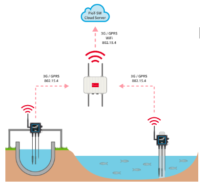
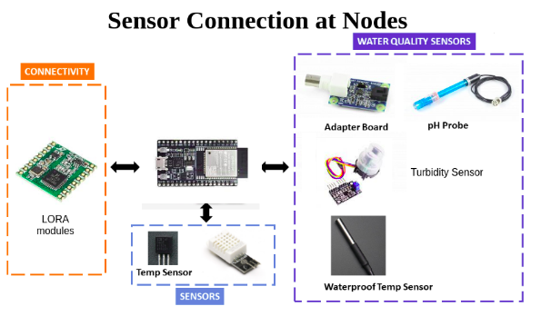
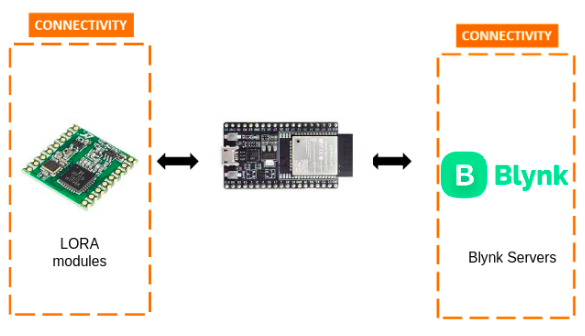
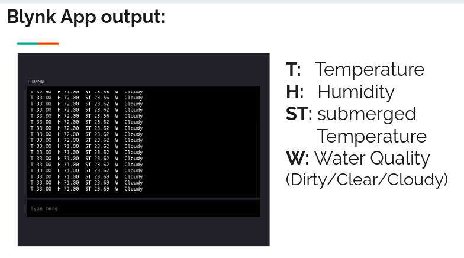

# Aqua Farm Monitoring System

## Introduction 

    

Aqua Farm Monitoring System has several sensor nodes installed in the field, which extracts the data like Water temperature, humidity, pH and quality. These data are processed by ESP32 in sensor node and sent to Central node via LoraWAN.

### Sensors Interfaced with ESP32:

- DHT11
- DS18B20
- pH sensor
- Turbidity sensor

## Block diagram of Sensor Node:

    

## Block diagram of Central Node:

    

### Aqua Farm Monitor System Output:

- [Final Demo](https://www.youtube.com/watch?v=ljy_Szw1oFM)
- [Final Code](https://github.com/ombhilare999/Aqua_Farm_Monitor/tree/main/Lora_Test)

    

