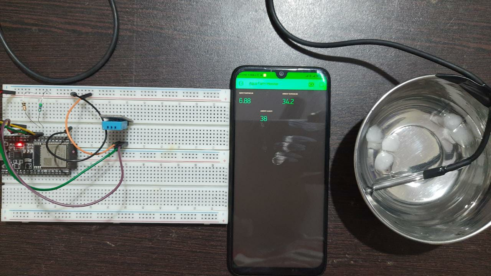
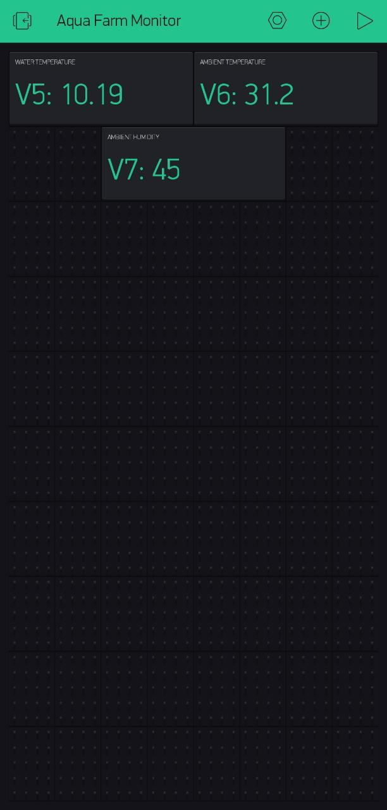

# Aqua_Farm_Monitor
IOT system to monitor Aqua Farming

- [DS18B20 Temperature Sensor to Arduino](https://github.com/ombhilare999/Aqua_Farm_Monitor/blob/main/DS18B20/ds18b20.md)

### DS18B20 + DHT11 Interfaced with ESP32 DevkitC V4:

    

### Aqua Farm Monitor System:

    

